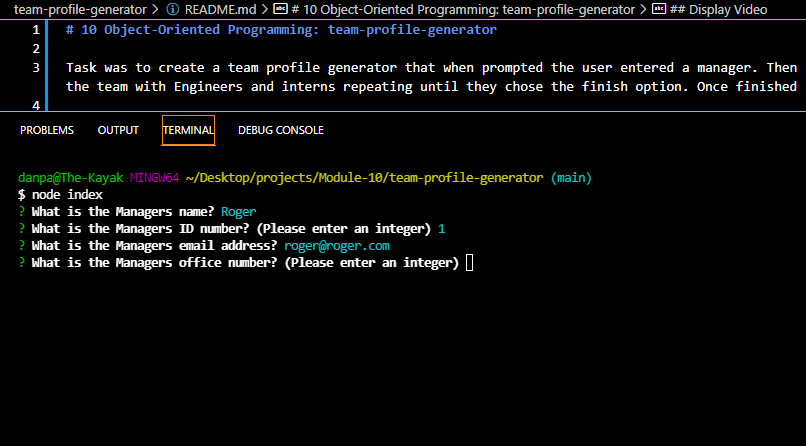
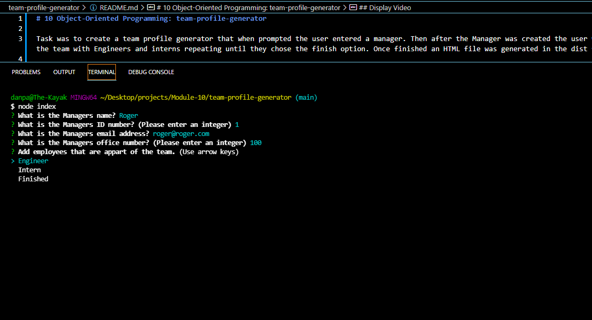
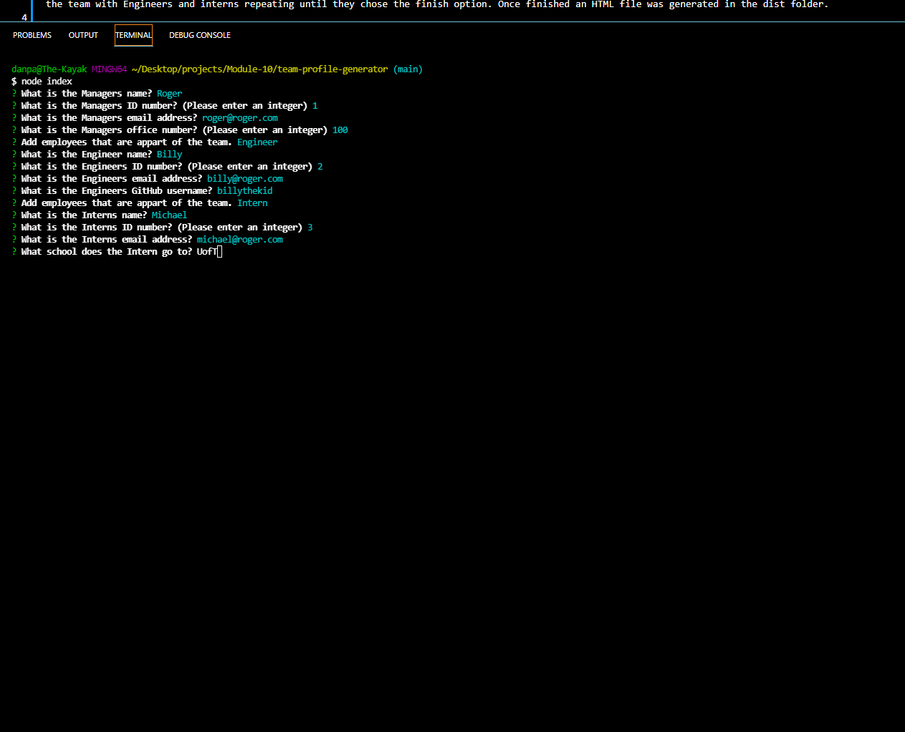
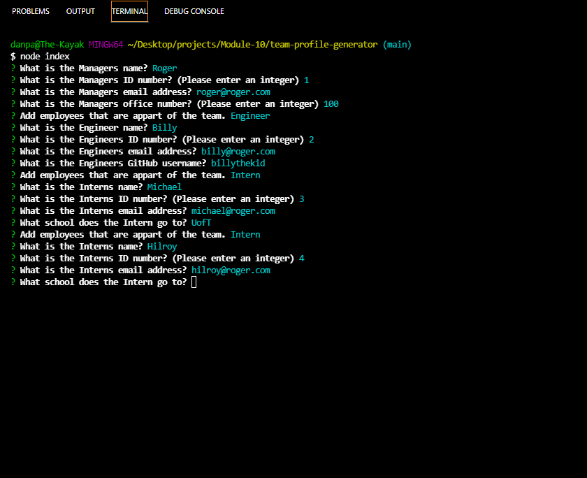
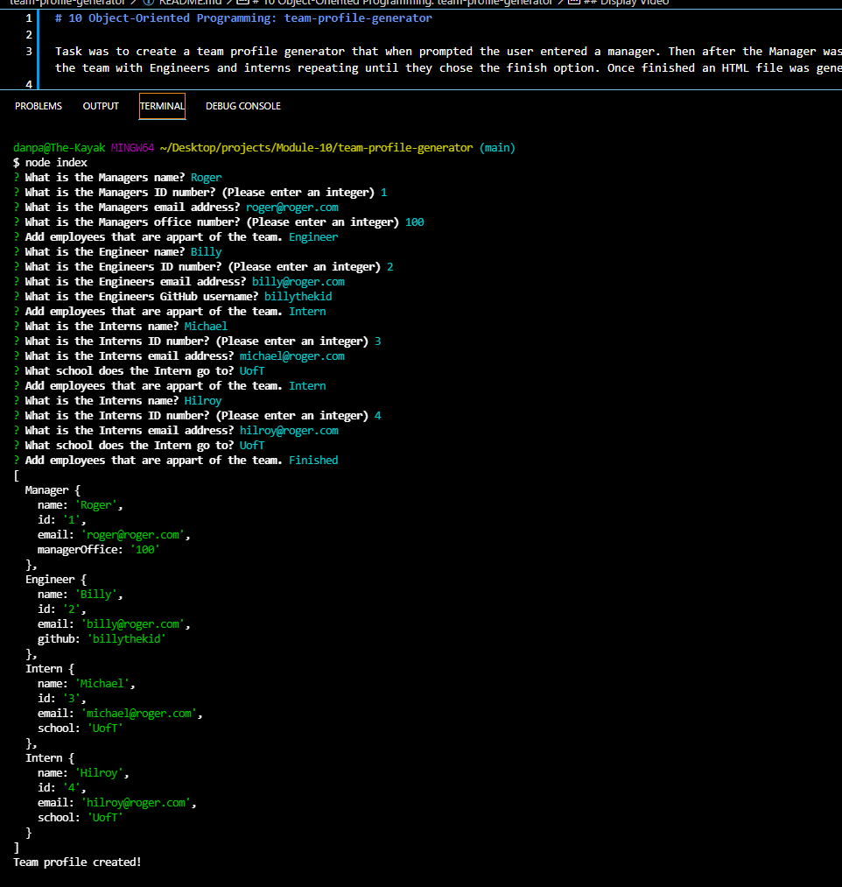
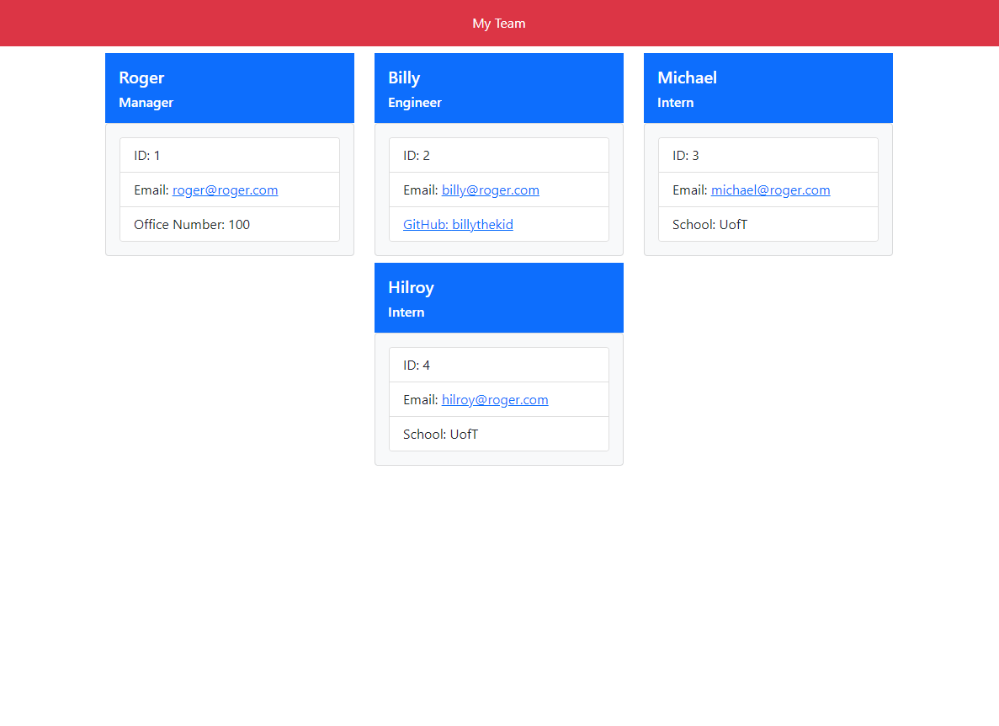

# 10 Object-Oriented Programming: team-profile-generator

Task was to create a team profile generator that when prompted the user entered a manager. Then after the Manager was created the user was prompted to build out the team with Engineers and interns repeating until they chose the finish option. Once finished an HTML file was generated in the dist folder.

## Steps
* Created the repository and all the necessary folders and base files
* installed npm, iquirer and jest
* created the questions the user had to go through and answer for manager
* created the function of questions to ask the user if they wanted to enter an engineer, an intern or finish.
* created the engineer and intern function and questions
* created the classes for Employee, Manager, Engineer, and Intern
* tested to make sure that all the user input was stored correctly in an array of objects
* wrote a test base HTML to use bootstrap to stylize the page
* created the src file that all the input is passed through and then the HTML page is created
* wrote the function that sent the input array to the write file and then created the file
* now that everything was complete I went back and created tests for the 4 classes(Employee, Manager, Engineer, and Intern)
* the 2 steps were to flush out the README with details and screenshots, and create the screen record of the app demo to submit.

## Screenshots

## Display Video
[video displaying the functioning of the app](https://watch.screencastify.com/v/5Sr3E2YSe9NjlQxHRsKL)